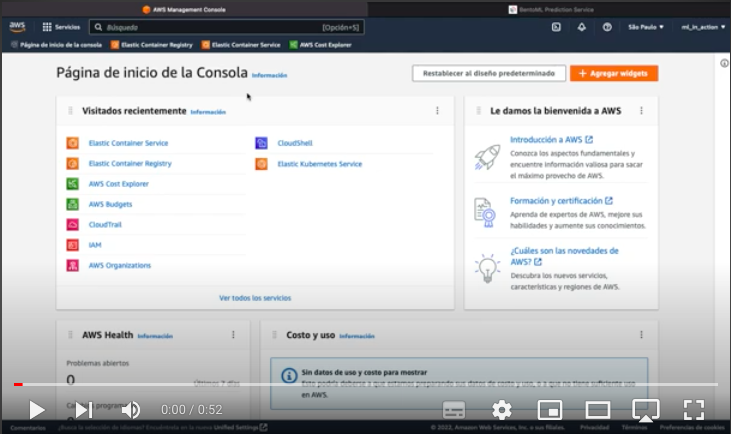
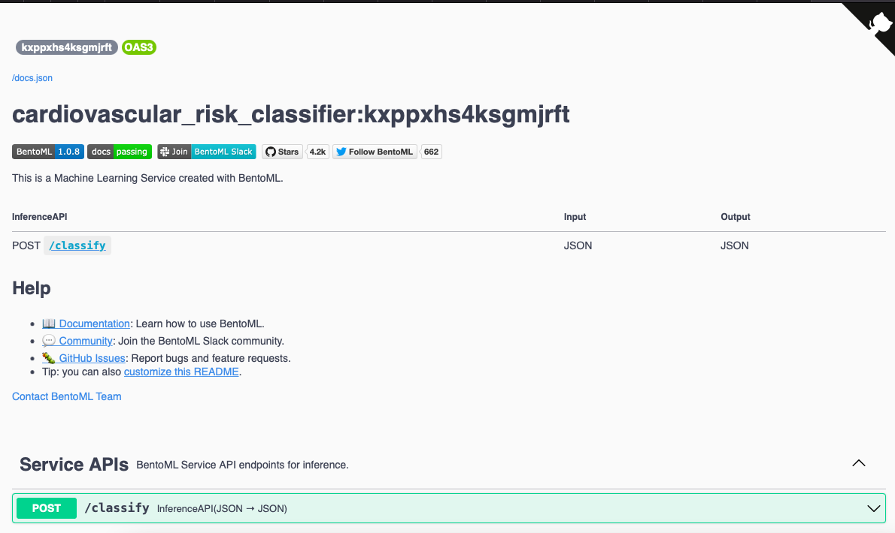
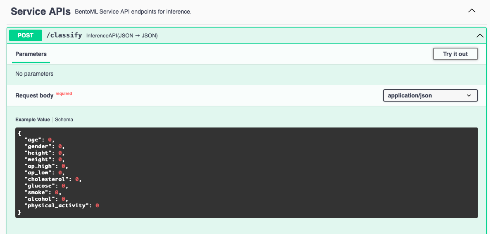
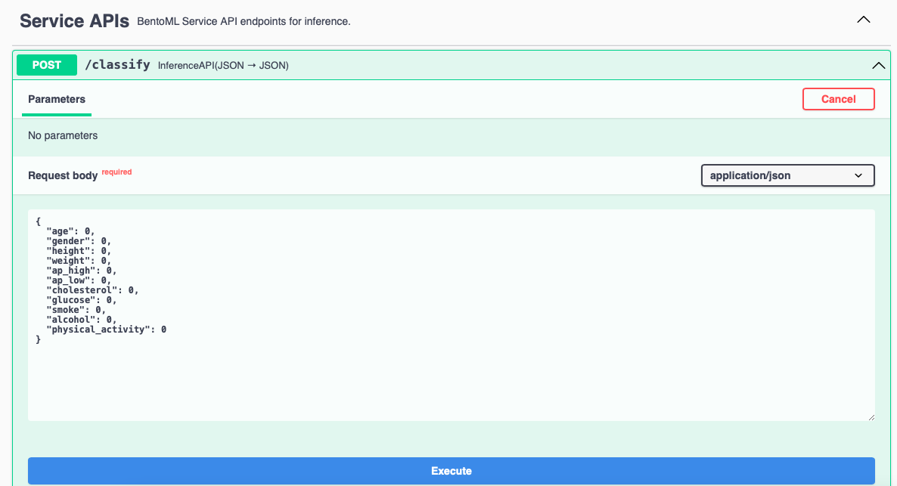
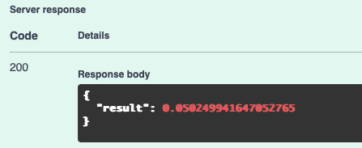

# Cardiovascular disease risk model

## About the project:
The availability of health monitoring equipment is increasing every day and the objective of this project 
is to use this information to warn of the risk of cardiovascular diseases.

This model allows predicting the probability of suffering from cardiovascular disease,
with an accuracy of 80%, trained from a database of more than 68,000 data, with the aim of alerting people to this risk.

## Video of the model running on aws:
[](https://youtu.be/AuI64vn1aDI)

## For running localy download the docker image from:

```docker
docker pull maryorihuela/cardiovascular_diseases_risk
```

## Run localy:
```docker
docker run -it --rm -p 3000:3000 maryorihuela/cardiovascular_diseases_risk serve --production
```

## Try the service:
Just opening a browser to <http://localhost:3000>
And follow the instructions:


 
On the Service APIs section, click the option: Post/classify:



Next click the Try it out button and complete the Request body:



### Acceptable values:
* age: years of age
* gender: 1 - women, 2 - men
* height: cm
* weight: kg
* ap_high: systolic blood pressure
* ap_low: diastolic blood pressure
* cholesterol: 1: normal, 2: above normal, 3: well above normal
* glucose: 1: normal, 2: above normal, 3: well above normal
* smoke: 0: no, 1: yes
* alcohol: 0: no, 1: yes
* physical_activity: 0: no, 1: yes

### Here is a sample for you to try:

```json
{
  "age": 38,
  "gender": 1,
  "height": 165,
  "weight": 54,
  "ap_high": 120,
  "ap_low": 60,
  "cholesterol": 1,
  "glucose": 1,
  "smoke": 0,
  "alcohol": 0,
  "physical_activity": 1
}
```

When you complete the data click on execute and you can see the probability below in the box
Response body, like:



## Data: 
* You can download the dataset from this link on kaggle: <https://www.kaggle.com/datasets/aiaiaidavid/cardio-data-dv13032020?select=cardiovascular_diseases_dv3.csv>

* Another option from github:   <https://github.com/mary435/cardiovascular_diseases_risk_model/blob/28c9346a431fdfe8543174c9ea6af4dfd89074c9/cardiovascular_diseases_dv3.csv>

* Third option download it from the notebook. I leave the lines with wget ready.

## [Notebook](notebook.ipynb)
The notebook was created with this anaconda environment: [cardio_project_env.yaml](cardio_project_env.yaml)

Download it and import it to your anaconda, option environments, import.

Next, open the jupyter Notebook file and run it to view the EDA analyzes and training of differents models.

In the xgboost model, for the parameter adjustment, you will find a line with the comment ####### that indicates 
the different parameters that you need to change, to then execute this cell again and see the graph with the comparison with them.

## [train.py](train.py)
This script reads the dataset that should be saved in the same folder with the name: 'cardiovascular_diseases_dv3.csv'. 
Then prepares the data, trains the final model and saves it with BentoML.

Download this files at the same folder with the dataframe:
* [bentofile.yaml](bentofile.yaml)
* [train.py](train.py)
* [service.py](service.py)

* For anaconda environ: [cardio_project_env.yaml](cardio_project_env.yaml) If you haven't downloaded it yet
* Alternatively with pipenv: [Pipfile](Pipfile) [Pipfile.lock](Pipfile.lock)

Next: 
 * From anaconda's "open terminal" option. 
 * With pipenv: run ```pipenv install```  When finished run ```pipenv shell```

Now you can run the "train.py" script with the ```python train.py``` command this read the dataset,
prepare the data, train the final model, and save it with BentoML.

Next to start the service locally run the comand ```bentoml serve service:svc --production```

Just opening a browser to <http://localhost:3000>
And follow the same instructions as above for running the model.


## From bentoml model to Docker image 
Open your docker and run this command in the same folder and environ that we used for the project:  ```bentoml build ``` 
As a result will receibe a message like this:
```
(cardio_project) Marilinas-MacBook-Air:cardio_project marilinaorihuela$ bentoml build
Building BentoML service "cardiovascular_risk_classifier:xslsx4c63wv5jrft" from build context "/Users//Documents/cardio_project".
Packing model "cardiovascular_diseases_risk_model:b6n5rxc63gzabrft"
Locking PyPI package versions.
/opt/anaconda3/envs/cardio_project/lib/python3.10/site-packages/_distutils_hack/__init__.py:33: UserWarning: Setuptools is replacing distutils.
  warnings.warn("Setuptools is replacing distutils.")

██████╗░███████╗███╗░░██╗████████╗░█████╗░███╗░░░███╗██╗░░░░░
██╔══██╗██╔════╝████╗░██║╚══██╔══╝██╔══██╗████╗░████║██║░░░░░
██████╦╝█████╗░░██╔██╗██║░░░██║░░░██║░░██║██╔████╔██║██║░░░░░
██╔══██╗██╔══╝░░██║╚████║░░░██║░░░██║░░██║██║╚██╔╝██║██║░░░░░
██████╦╝███████╗██║░╚███║░░░██║░░░╚█████╔╝██║░╚═╝░██║███████╗
╚═════╝░╚══════╝╚═╝░░╚══╝░░░╚═╝░░░░╚════╝░╚═╝░░░░░╚═╝╚══════╝

Successfully built Bento(tag="cardiovascular_risk_classifier:xslsx4c63wv5jrft").
```

Second for create the docker image run the command ```bentoml containerize cardiovascular_risk_classifier:latest ``` 

Finally you will receive a result like this:
```
Successfully built docker image for "cardiovascular_risk_classifier:latest" with tags "cardiovascular_risk_classifier:xslsx4c63wv5jrft"
To run your newly built Bento container, pass "cardiovascular_risk_classifier:xslsx4c63wv5jrft" to "docker run". 
For example: "docker run -it --rm -p 3000:3000 cardiovascular_risk_classifier:xslsx4c63wv5jrft serve --production".
```


Where indicates the command for run the service from the docker image like above. ```docker run -it --rm -p 3000:3000 cardiovascular_risk_classifier:xslsx4c63wv5jrft serve --production```  

Now just opening a browser to <http://localhost:3000>
And follow the same instructions as above for running the model.


## Push to docker hub

* First, you will need your own docker hub username and logged in your docker desktop app.
* Second tag your image with your docker hub username. For that use this command and replace maryorihuela for yours username:```docker tag cardiovascular_risk_classifier:xslsx4c63wv5jrft maryorihuela/cardiovascular_risk_classifier:latest```
* Third push the image with this command:```docker push maryorihuela/cardiovascular_risk_classifier:latest```
* FInally start the service: ```docker run -it --rm -p 3000:3000 maryorihuela/cardiovascular_risk_classifier:latest serve --production```

Now just opening a browser to <http://localhost:3000>
And follow the same instructions as above for running the model.

## Push to AWS
* First install AWS client with this command: ```pipenv install awsebcli --dev```
* Second command ```aws configure```  And you can confire your account:
```AWS Access Key ID [None]: 
AWS Secret Access Key [None]: 
Default region name [None]: 
Default output format [None]: 
```
* Third command for create a repository (replace the region)
```
aws ecr create-repository \
    --repository-name cardio-project \
    --image-scanning-configuration scanOnPush=true \
    --region sa-east-1
```
* Retrieve an authentication and authentication token from your Docker client in the registry (replace aws_account_id): ```aws ecr get-login-password --region sa-east-1 | docker login --username AWS --password-stdin aws_account_id.dkr.ecr.sa-east-1.amazonaws.com```

* Tag the image to push to your repository (replace aws_account_id and region): ```docker tag maryorihuela/cardiovascular_risk_classifier:latest aws_account_id.dkr.ecr.region.amazonaws.com/cardio-project:latest``` 

* Push the image ```docker push aws_account_id.dkr.ecr.region.amazonaws.com/cardio-project:latest```

* Now create a new cluster with this command: ```aws ecs create-cluster --cluster-name fargate-cardio-cluster``` And will obtain this output
```
{
    "cluster": {
        "clusterArn": "arn:aws:ecs:region:aws_account_id:cluster/fargate-cardio-cluster",
        "clusterName": "fargate-cardio-cluster",
        "status": "ACTIVE",
        ...continue
````
* In the same way now register a new task definition. This requires a file.json dowload this file: [fargate-task.json](fargate-task.json)
    * This file has a generic line: ```"image": "public.ecr.aws/docker/library/httpd:latest", ``` where you need indicates the "URI" of you image, the same we use to push the image: ```aws_account_id.dkr.ecr.region.amazonaws.com/cardio-project```
    *  You will need a ecsTaskExecutionRole. Check you AIM Service and serch the ARN.
    
* Now run this command to create the task  ```aws ecs register-task-definition --cli-input-json file://fargate-task.json --execution-role-arn arn:aws:iam::aws_account_id:role/ecsTaskExecutionRole```

* Subsequently need to create a Service, please use your oun security group: ```aws ecs create-service --cluster fargate-cardio-cluster --service-name fargate-service --task-definition sample-fargate:1 --desired-count 1 --launch-type "FARGATE" --network-configuration "awsvpcConfiguration={subnets=[subnet-082a1e8f28c84476d],securityGroups=[security group],assignPublicIp=ENABLED}"```

```"service": {
        "serviceArn": "arn:aws:ecs:sa-east-1:aws_account_id:service/fargate-cardio-cluster/fargate-service",
        "serviceName": "fargate-service",
        "clusterArn": "arn:aws:ecs:sa-east-1:aws_account_id:cluster/fargate-cardio-cluster",
        ...continue

```
* Obtain the arn with this command: 
```aws ecs list-tasks --cluster fargate-cardio-cluster --service fargate-service```
Output:
```{
    "taskArns": [
        "arn:aws:ecs:sa-east-1:aws_account_id:task/fargate-cardio-cluster/e6886bbe19d2420fba5b3e10cb79dd7d"
    ]
}
```
* Take the ARN from the previus output and run 
```aws ecs describe-tasks --cluster fargate-cardio-cluster --tasks arn:aws:ecs:sa-east-1:aws_account_id:task/fargate-cardio-cluster/e6886bbe19d2420fba5b3e10cb79dd7d```
A big output now start wit:
```{
    "tasks": [
        {
            "attachments": [
                {
                    "id": "18e4576c-ace9-47d7-9a70-34377cacf",
                    "type": "ElasticNetworkInterface",
                    "status": "ATTACHED",
                    "details": [
                        {
                            "name": "subnetId",
                            "value": "subnet-082a1e8f28c84476d"
                        },
                        {
                            "name": "networkInterfaceId",
                            "value": "eni-00d09014780e74a74"
                  ...continue
```
* Take the eni from the previus task and run: ``` aws ec2 describe-network-interfaces --network-interface-id  eni-00d09014780e74a74```
```
{
    "NetworkInterfaces": [
        {
            "Association": {
                "IpOwnerId": "amazon",
                "PublicDnsName": "ec2-18-228-150-152.sa-east-1.compute.amazonaws.com",
                "PublicIp": "18.228.152.61"
                
                ...continue
```

* Finally take this public IP and add ":3000" at the end like this: http://18.228.152.61:3000 for try your new service. 

* For clean up AWS run this 2 commands: 
```
aws ecs delete-service --cluster fargate-cardio-cluster --service fargate-service --force
aws ecs delete-cluster --cluster fargate-cardio-cluster
```


```
Marilina Orihuela
mary.orihuela@gmail.com
```


     

